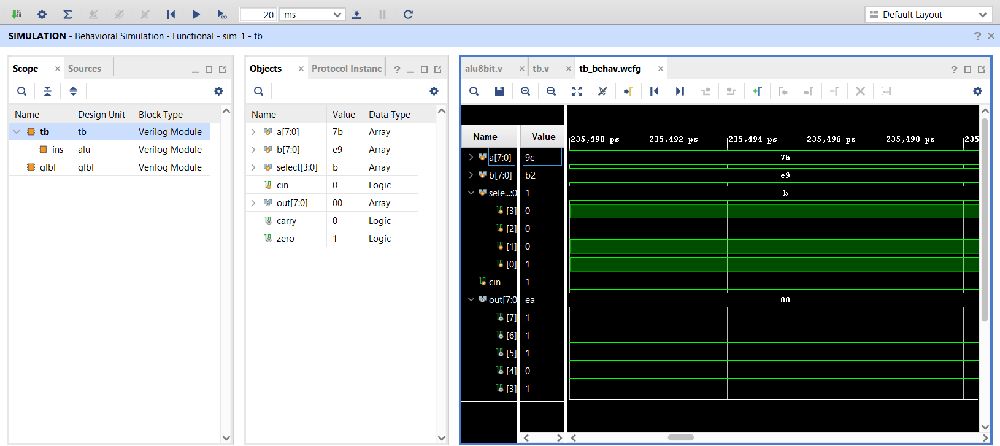
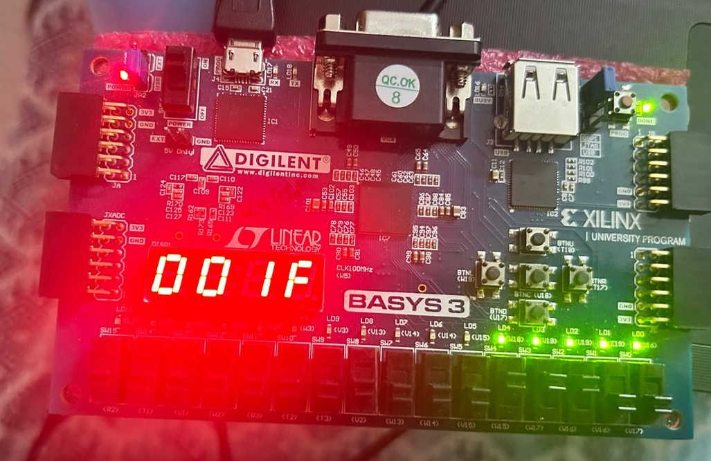
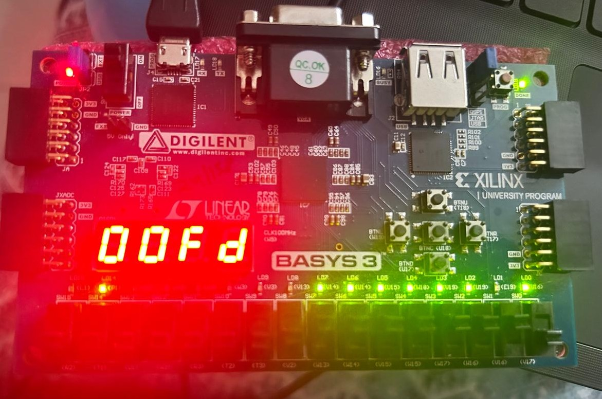

# FPGA 8-bit ALU using Verilog

## Overview

This project implements an **8-bit Arithmetic Logic Unit (ALU)** on the **Digilent Basys 3 FPGA** using **Verilog HDL**.

The ALU supports arithmetic, logical, comparison and shift operations. The design was verified through simulation in Vivado and successfully implemented on FPGA hardware.

---

## Features

- 8-bit ALU
- Verilog HDL implementation
- Basys 3 FPGA implementation
- Seven-segment display output
- Carry Flag
- Zero Flag
- Hardware verified

---

## Supported Operations

| Select | Operation |
|---------|-----------|
|0000|Addition|
|0001|Subtraction|
|0010|Increment|
|0011|Decrement|
|0100|Bitwise AND|
|0101|Bitwise OR|
|0110|Bitwise XOR|
|0111|Bitwise NOT|
|1000|Logical Left Shift|
|1001|Logical Right Shift|
|1010|Arithmetic Right Shift|
|1011|Signed Less Than|

---

## Repository Structure

```text
FPGA_8bit_ALU
│
├── src
│   ├── alu8bit.v
│   ├── top.v
│   ├── debouncer.v
│   └── seven_segment.v
│
├── constraints
│   └── top.xdc
│
├── simulation
│   ├── tb.v
│   └── tb_behav.wcfg
│
├── images
│   ├── 8bit_alu_waveform.png
│   ├── fpga_demo_1.jpg
│   └── fpga_demo_2.jpg
│
├── README.md
├── LICENSE
└── .gitignore
```

---

## Simulation

Simulation was performed using the Vivado simulator.

### Waveform



---

## FPGA Implementation

The design was synthesized, implemented and tested on the Digilent Basys 3 FPGA board.

### Hardware Demo

#### Demo 1



#### Demo 2



---

## Source Files

| File | Description |
|------|-------------|
|alu8bit.v|8-bit ALU implementation|
|top.v|Top level module|
|debouncer.v|Push-button debouncer|
|seven_segment.v|Seven-segment display controller|
|tb.v|Simulation testbench|
|top.xdc|Basys 3 constraints|

---

## FPGA Board

- Digilent Basys 3
- Xilinx Artix-7 FPGA
- Vivado Design Suite

---

## Tools Used

- Verilog HDL
- Xilinx Vivado
- Basys 3 FPGA

---

## Future Improvements

- Overflow flag
- Signed arithmetic extensions
- UART interface
- Pipeline implementation
- Parameterized ALU width

---

## Author

Developed by **Sriya Atluri**

B.Tech in VLSI Design and Technology

National Institute of Technology Delhi